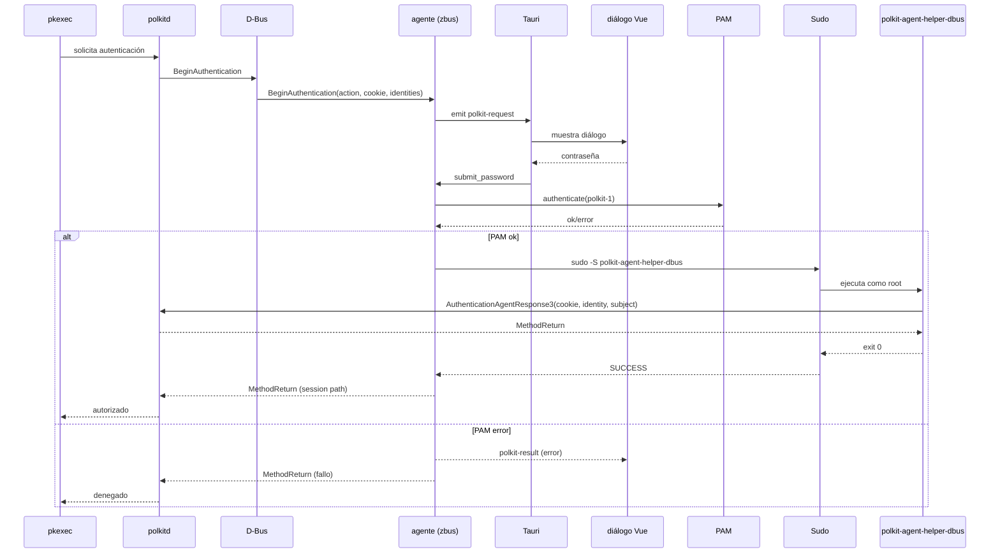

# vasak-polkit-agent

Agente de autenticación de PolicyKit para VasakOS.

## ¿Qué es?

`vasak-polkit-agent` es un agente de PolicyKit que se registra en el bus
D-Bus del sistema para manejar solicitudes de autenticación de aplicaciones
como `pkexec`. Muestra una ventana minimalista para que el usuario ingrese
su contraseña y completa el flujo de autenticación.

## Arquitectura



### Componentes

- **`vasak-polkit-agent`** — Binario principal (Tauri + zbus).
  - Se registra como agente PolicyKit en `unix-session:2`.
  - Recibe `BeginAuthentication` vía D-Bus, muestra un diálogo de contraseña.
  - Valida con PAM (servicio `polkit-1`) y llama a `AuthenticationAgentResponse3`
    mediante un helper ejecutado como root vía sudo.
  - Bloquea `BeginAuthentication` hasta que el helper completa la llamada
    D-Bus (requisito de polkitd ≥ 127).

- **`polkit-agent-helper-dbus`** — Helper setuid (ejecutado via sudo).
  - Abre un pidfd del proceso solicitante (`pidfd_open`).
  - Lee `start-time` de `/proc/PID/stat`.
  - Llama a `AuthenticationAgentResponse3` en el bus del sistema con
    el subject `unix-process` (pid + pidfd + start-time).

## Requisitos

- Rust 1.85+
- Node.js 20+ / Bun
- Tauri CLI 2.x
- D-Bus
- Polkit ≥ 127
- sudo

## Compilar

```bash
bun install
cargo tauri build
```

Los binarios se generan en `src-tauri/target/release/`:
- `vasak-polkit-agent`
- `polkit-agent-helper-dbus`

## Instalación

```bash
sudo install -m 755 src-tauri/target/release/vasak-polkit-agent /usr/bin/
sudo install -m 755 src-tauri/target/release/polkit-agent-helper-dbus /usr/bin/
```

Configuración D-Bus necesaria en
`/usr/share/dbus-1/system.d/org.freedesktop.PolicyKit1.conf`:

```xml
<policy user="polkitd">
  <allow send_interface="org.freedesktop.PolicyKit1.AuthenticationAgent"/>
</policy>
```

## Desarrollo

```bash
bun run tauri dev
```

Esto inicia el agente y el frontend con hot-reload. Ejecutar `pkexec id`
en otra terminal para probar.
